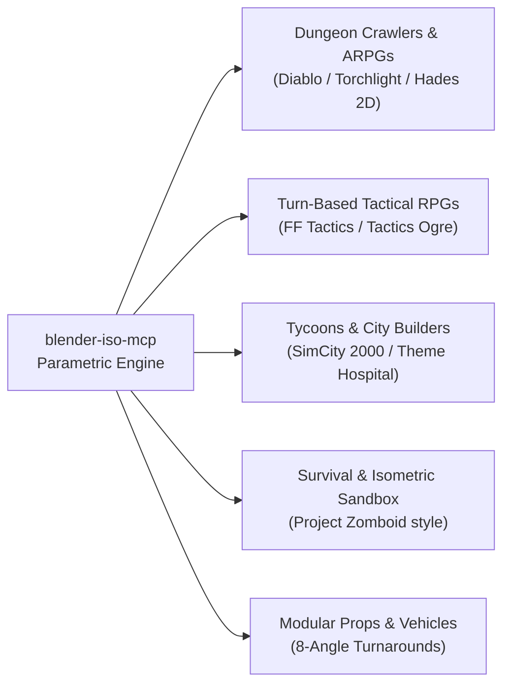

<div align="center">

# blender-iso-mcp

**Model Context Protocol bridge for 2:1 dimetric isometric NPR assets and virtual rooms in Blender**

Procedural 2:1 dimetric isometric scene generation, non-photorealistic NPR cel-shading, avatar turnaround rendering, and game engine integration for Blender.

[](LICENSE)
[](https://nodejs.org)
[](https://www.blender.org)
[](tests)
[](https://www.typescriptlang.org)
[](https://pnpm.io)

[**Quickstart**](#quickstart) · [**Features**](#features) · [**Archetypes**](#universal-isometric-game-archetypes) · [**Components**](#components) · [**Installation**](#installation) · [**Client Setup**](#client-setup) · [**Tools Reference**](#tools-reference) · [**Viewer**](#interactive-viewer) · [**Specifications**](#mathematical-specifications) · [**Security**](#security--owasp-hardening)

</div>

---

## Quickstart

Three steps: install dependencies, start the Blender bridge, and connect your client.

**1. Install Dependencies and Build**

```bash
# Using pnpm (recommended)
pnpm install && pnpm run build

# Or using standard npm
npm install && npm run build
```

**2. Start Blender in Background Mode**

```bash
# macOS
/Applications/Blender.app/Contents/MacOS/Blender --background --python scripts/blender_bridge_server.py

# Linux
blender --background --python scripts/blender_bridge_server.py

# Windows
blender.exe --background --python scripts\blender_bridge_server.py
```

**3. Configure Your Client**

<details open>
<summary><b>Claude Desktop</b> — claude_desktop_config.json</summary>

```json
{
  "mcpServers": {
    "blender-iso": {
      "command": "node",
      "args": [
        "dist/presentation/mcp/server.js"
      ],
      "env": {
        "BLENDER_HOST": "127.0.0.1",
        "BLENDER_PORT": "9876"
      }
    }
  }
}
```

</details>

<details>
<summary><b>Cursor</b> — settings.json</summary>

```json
{
  "mcp.servers": {
    "blender-iso": {
      "command": "node",
      "args": [
        "dist/presentation/mcp/server.js"
      ]
    }
  }
}
```

</details>

<details>
<summary><b>Antigravity CLI</b></summary>

```bash
agy mcp add blender-iso node dist/presentation/mcp/server.js
```

</details>

<details>
<summary><b>VS Code</b></summary>

```json
{
  "mcp": {
    "servers": {
      "blender-iso": {
        "command": "node",
        "args": ["dist/presentation/mcp/server.js"]
      }
    }
  }
}
```

</details>

> **Note:** Ensure Blender runs with the bridge addon active before issuing commands through your client.

---

## Table of Contents

- [Quickstart](#quickstart)
- [Features](#features)
- [Universal Game Archetypes](#universal-isometric-game-archetypes)
- [Components](#components)
- [Installation](#installation)
  - [Supported Versions](#supported-versions)
  - [Build Steps](#build-steps)
  - [Configuration](#configuration)
- [Client Setup](#client-setup)
- [Tools Reference](#tools-reference)
  - [Example Prompts](#example-prompts)
- [Interactive Viewer](#interactive-viewer)
- [Mathematical Specifications](#mathematical-specifications)
  - [Dimetric 2:1 Projection](#dimetric-21-projection)
  - [Subpixel Collision Diamonds](#subpixel-collision-diamonds)
  - [Dynamic Depth Sorting](#dynamic-depth-sorting)
- [Security & OWASP Hardening](#security--owasp-hardening)
- [Troubleshooting](#troubleshooting)
- [Feedback](#feedback)
- [License](#license)
- [Disclaimer](#disclaimer)

---

## Features

| Capability | Description |
|---|---|
| 2:1 Dimetric Camera Rig | Calibrated Euler rotation `(60°, 0°, 45°)` with exact tangent slope and scale synchronization. |
| Procedural Room Synthesis | Automated virtual social lounges with ergonomic furniture, multi-tier platforms, and capacity metrics. |
| Stylized NPR Cel-Shading | Palette-indexed non-photorealistic materials with defined silhouette outlines and zero sampling noise. |
| Multi-Angle Avatar Pipeline | Eight-direction character turnarounds rendered in subpixel dimetric projection. |
| 2D Lighting Pass Decomposition | Automated extraction of Albedo, Normal 2D, Depth Map, and Shadow Mask for dynamic runtime shaders. |
| Turnkey Game Engine Manifests | Direct integration files for Phaser, PixiJS, Three.js, Babylon.js, Excalibur, and Godot 4 TileSets. |
| Subpixel Collision Diamonds | Mathematically exact 2:1 collision polygon coordinates, interactive seat registries, and waypoints. |
| Enterprise OWASP Hardening | Strict path traversal defenses, null-byte filtering, loopback network binding, and execution timeouts. |

---

## Universal Isometric Game Archetypes

While virtual lounges and social rooms serve as comprehensive architectural stress tests (validating complex occlusions, multi-tiered $Z$ platforms, and seating collisions), `blender-iso-mcp` is architected as an **engine-agnostic 2:1 dimetric asset and world pipeline**. It natively caters to any game genre operating within the dimetric 2:1 projection plane:



### 1. ARPGs & Procedural Dungeon Crawlers (Diablo / Torchlight Style)
* **Stone Tileways & Catacombs**: Generate modular dungeon floors, stone masonry walls, wall arches, and underground stairs with discrete collision polygons.
* **Dynamic 2D Lighting Normal-Maps**: Using `blender_iso_bake_passes`, each tile and dungeon prop exports Albedo, Normal Map, Depth, and Shadow Mask passes. Web and native engines (Godot 4, Phaser, PixiJS) can illuminate 2D dungeon corridors with dynamic real-time torch light.

### 2. Turn-Based Tactical RPGs (Final Fantasy Tactics / Tactics Ogre Style)
* **Discrete Stepped Elevation Grids**: The `WorldBlueprintEntity` parses elevations `0` through `9` ($Z = \text{digit} \times 0.25$), generating stepped cliffs, plateaus, and cardinal ramp slopes (`^, v, <, >`).
* **Subpixel Diamond Collision**: Every tile quadrant exports its exact mathematical centroid and diamond vertices, allowing tactical game engines to compute jumping range, projectile trajectory arcs, and line-of-sight without manual mapping.

### 3. Tycoons & Management Sims (SimCity 2000 / RollerCoaster Tycoon / Theme Hospital)
* **Modular Building Units**: Combine perimeter walls, interior dividers, staircases, and functional props (counters, desks, chairs, technical stations) to synthesize custom facilities.
* **Topographical Grids**: Create continuous rolling terrain with stepped elevations and multi-layered infrastructure.

### 4. Survival & Isometric Sandbox (Project Zomboid Style)
* **Reinforced Enclosures**: Generate boarded windows, modular barricades, perimeter fences, and doorways with exact anchor pivots.
* **8-Direction Character Pipelines**: The `blender_iso_create_avatar` and `blender_iso_render_turnaround` tools generate full 8-angle turnaround spritesheets for players, NPCs, zombies, and vehicles.

### 5. Architectural Non-Goals (Scope Boundaries)
To ensure optimal performance and specialized fidelity, the project maintains strict boundaries:
* **No Runtime 3D Meshes**: The system never exports heavy 3D geometry (GLTF/FBX) for runtime rendering; it produces optimized 2D spritesheets, atlas manifests, and collision coordinates.
* **No Photorealistic Ray-Tracing**: Tailored for non-photorealistic stylized rendering (Cel-Shading, Toon, and Pixel Art) with zero sampling noise.
* **No Perspective Cameras**: Operates strictly within the calibrated dimetric 2:1 orthographic camera rig ($\arctan(0.5) \approx 26.565^\circ$).

---

## Components

1. **TypeScript MCP Server** (`server/presentation/mcp/server.ts`) — A Model Context Protocol server exposing typed JSON-RPC tools over standard I/O.
2. **Native Blender Addon** (`addon/__init__.py`) — An asynchronous WebSocket server running inside Blender that executes parametric modeling and rendering.
3. **Domain Core** (`server/domain/`) — Pure business logic, 2:1 dimetric projection mathematics, immutable value objects, and collision diamond calculations.
4. **Infrastructure Storage and Exporters** (`server/infrastructure/`) — Multi-engine export adapters, safe path sanitization, and canonical directory resolution.
5. **Interactive Web Viewer** (`examples/interactive-viewer/index.html`) — A standalone HTML5 canvas application with real-time 2:1 depth sorting and click-to-walk navigation.

---

## Installation

### Supported Versions

| Technology | Supported Version Range | Recommended | Details |
|---|---|---|---|
| **Blender** | **`3.6 LTS` to `5.2+ LTS`** | `5.2+ LTS` or `4.2+ LTS` | Native Extension System (`blender_manifest.toml`) on 4.2+ / 5.2+. Classic addon on 3.6 – 4.1. |
| **Node.js** | **`20.0.0` to `24.x+`** | `20.x LTS` or `22.x LTS` | Full native support for ES Modules, `node:test`, `node:assert`, and crypto APIs across Active LTS. |
| **Package Manager** | **`pnpm`**, **`npm`**, or **`bun`** | `pnpm >=8.0` | `npm install && npm run build` works out of the box with zero extra configuration. |
| **MCP Client Runtime** | **`node` binary only** | Any system with `node` | **No package manager required at runtime**. Claude Desktop, Cursor, and Antigravity execute `node dist/presentation/mcp/server.js` directly. |

### Build Steps

Clone the repository and compile the TypeScript source files.

```bash
# Via SSH (recommended)
git clone git@github.com:fr4ncisx/blender-mcp.git
cd blender-mcp

# Or via HTTPS
git clone https://github.com/fr4ncisx/blender-mcp.git
cd blender-mcp

# With pnpm (recommended)
pnpm install
pnpm run build

# Or with standard npm
npm install
npm run build
```

### Configuration

The server resolves runtime parameters dynamically with zero required setup, following a deterministic four-tier precedence hierarchy:

$$\text{CLI Flags} \succ \text{Process Environment (MCP Client JSON)} \succ \text{Local \texttt{.env}} \succ \text{Zero-Config Defaults}$$

#### Precedence Hierarchy & Methods

1. **CLI Flags (Highest Priority)**: Pass flags directly via the client `args` array or terminal:
   ```json
   "args": [
     "dist/presentation/mcp/server.js",
     "--port=9880",
     "--host=127.0.0.1"
   ]
   ```
2. **Process Environment (MCP Client JSON)**: Injected per-process by your AI client (Claude Desktop, Cursor, VS Code) without polluting your host operating system:
   ```json
   "env": {
     "BLENDER_PORT": "9876",
     "BLENDER_HOST": "127.0.0.1"
   }
   ```
3. **Local `.env` File**: Place a `.env` file in the project root for local testing or custom deployment profiles:
   ```env
   BLENDER_PORT=9876
   BLENDER_HOST=127.0.0.1
   BLENDER_TIMEOUT_MS=20000
   ```
4. **Zero-Config Auto-Detection (Default)**: If no configuration is provided, the server defaults to `127.0.0.1:9876` and automatically discovers the Blender executable from system `PATH` and standard installation directories across Windows, macOS, and Linux.

#### Configuration Reference

| Option (CLI Flag) | Short Flag | Environment Variable | Default | Description |
|---|---|---|---|---|
| `--port=<number>` | `-p <number>` | `BLENDER_PORT` | `9876` | WebSocket port for bridge communication with Blender. |
| `--host=<ip>` | `-h <ip>` | `BLENDER_HOST` | `127.0.0.1` | Loopback IP address for secure local WebSocket transport. |
| `--blender=<path>` | `-b <path>` | `BLENDER_PATH` | System Auto-Detect | Absolute path to the Blender executable (versions 3.6 LTS to 5.2+ LTS). |
| `--token=<secret>` | `-t <secret>` | `BLENDER_AUTH_TOKEN` | None | Shared secret token for WebSocket authentication when isolation is required. |
| `--timeout=<ms>` | None | `BLENDER_TIMEOUT_MS` | `15000` | Communication timeout in milliseconds to prevent hung client calls. |

---

## Client Setup

<details open>
<summary><b>Claude Desktop</b></summary>

Add the server definition to `claude_desktop_config.json`:

```json
{
  "mcpServers": {
    "blender-iso": {
      "command": "node",
      "args": ["dist/presentation/mcp/server.js"],
      "env": {
        "BLENDER_HOST": "127.0.0.1",
        "BLENDER_PORT": "9876"
      }
    }
  }
}
```

</details>

<details>
<summary><b>Cursor</b></summary>

Configure the MCP server in **Settings → Features → MCP**:

- Name: `blender-iso`
- Type: `command`
- Command: `node dist/presentation/mcp/server.js`

</details>

<details>
<summary><b>Antigravity CLI</b></summary>

Register the server using the command-line interface:

```bash
agy mcp add blender-iso node dist/presentation/mcp/server.js
```

</details>

<details>
<summary><b>VS Code</b></summary>

Install the Model Context Protocol extension and add the entry to `.vscode/settings.json`:

```json
{
  "mcp.servers": {
    "blender-iso": {
      "command": "node",
      "args": ["dist/presentation/mcp/server.js"]
    }
  }
}
```

</details>

---

## Tools Reference

The server exposes nine declarative tools through the Model Context Protocol:

| Tool | Parameters | Description |
|---|---|---|
| `blender_iso_build_room` | `theme`, `roomScale`, `capacityTarget`, `palette`, `furniture`, `renderOutput` | Generates a complete virtual room diorama with furniture, lighting, and web engine integration manifests. |
| `blender_iso_create_avatar` | `name`, `directions`, `tileWidth`, `palette`, `outputDirectory` | Generates a stylized humanoid voxel character with eight-direction turnaround sprite renders. |
| `blender_iso_bake_assets` | `baseTileWidth`, `archetypes`, `outputDir`, `exportManifests` | Produces an atomic 2:1 isometric asset catalog with collision diamonds and engine manifests. |
| `blender_iso_setup_scene` | `resolutionWidth`, `unitSize`, `shadowColor`, `sunElevation` | Configures the dimetric camera rig, transparent background, and sun lighting in the active scene. |
| `blender_iso_create_tile` | `tileType`, `name`, `unitSize`, `unitHeight`, `subdivisions`, `generateCollision` | Generates parametric 3D isometric tile geometry based on standard dimetric grid templates. |
| `blender_iso_apply_npr_material` | `objectName`, `palette`, `outlineWidth`, `roughness` | Applies a cel-shaded non-photorealistic material with custom color bands and contour lines. |
| `blender_iso_render_turnaround` | `objectName`, `directions`, `tileWidth`, `outputDirectory`, `exportTarget` | Renders multi-angle orthographic sprites and generates engine-ready texture atlas manifests. |
| `blender_iso_bake_passes` | `objectName`, `resolutionWidth`, `passes`, `outputDirectory` | Extracts 2D render passes including Albedo, Depth, Normal 2D, and Shadow Mask for runtime shaders. |
| `blender_iso_inspect_scene` | None | Returns topological telemetry, bounding box dimensions, and object hierarchies from the active scene. |

### Example Prompts

| Intent | Prompt |
|---|---|
| Build an Art Déco social lounge | *"Build an Art Déco social lounge with an elevated bar platform, velvet couches, and a central staircase."* |
| Create a custom avatar | *"Create an isometric humanoid avatar with brown hair, a teal shirt, and dark trousers in eight directions."* |
| Bake an asset catalog | *"Bake an atomic isometric asset library with sixty-four pixel width tiles and collision manifests."* |
| Extract lighting passes | *"Extract 2D normal and depth passes for the active room diorama."* |

---

## Interactive Viewer

The repository includes a playable HTML5 canvas client located in `examples/interactive-viewer/index.html`.

1. Open `examples/interactive-viewer/index.html` in any modern web browser.
2. Click any location on the diorama to navigate. The client converts screen coordinates into 2:1 dimetric grid cells using inverse projection.
3. Observe real-time depth sorting. The avatar walks behind elevated bar counters and in front of rear walls based on its scalar depth value.
4. Toggle between rendered scenes using the room selector menu in the header.

---

## Mathematical Specifications

### Dimetric 2:1 Projection

The system enforces true 2:1 dimetric projection without perspective distortion:

- **Camera Rotation**: Euler angles $X = 60.0^\circ, Y = 0.0^\circ, Z = 45.0^\circ$.
- **Projection Slope**: $\arctan(0.5) \approx 26.565^\circ$.
- **Orthographic Scale**: $\text{scale} = \sqrt{2} \cdot \text{unit\_size}$.
- **Tile Aspect Ratio**: $\text{height} = \lfloor \text{width} / 2 \rfloor$.

### Subpixel Collision Diamonds

For a tile with width $W$ and height $H$, the four diamond vertices are calculated in clockwise order:

$$\left(\frac{W}{2}, 0\right), \quad \left(W, \frac{H}{2}\right), \quad \left(\frac{W}{2}, H\right), \quad \left(0, \frac{H}{2}\right)$$

### Dynamic Depth Sorting

Sorting order between overlapping isometric sprites uses screen vertical position adjusted for elevation:

$$\text{depth} = \text{screenY} + (\text{elevation} \cdot 1000)$$

---

## Security & OWASP Hardening

- **Path Traversal Defense**: All output directories and file paths pass through `SafePathSanitizer`. Untrusted paths containing null bytes `\0`, directory traversal sequences `..`, or targets outside the project boundary trigger a `SecurityError`.
- **Loopback Isolation**: The Blender WebSocket bridge binds exclusively to `127.0.0.1`. Remote network interfaces cannot access the socket server.
- **Request Timeouts**: Calls between the MCP server and Blender enforce a 15-second timeout, preventing denial of service lockups during long renders.

---

## Troubleshooting

| Problem | Fix |
|---|---|
| Connection refused on port `9876` | Start Blender in background mode with the addon active before connecting your MCP client. |
| Blender executable not found | Define `BLENDER_PATH` in your environment or install Blender in the default platform directory. |
| Path traversal rejected with `SecurityError` | Provide a relative path inside the repository root or update permitted roots in `SafePathSanitizer`. |
| Transparent background renders black | Call `blender_iso_setup_scene` to enable transparent film rendering in the EEVEE Next engine. |
| Avatar sprite renders flipped | Verify that the target angle matches the cardinal order defined in `getDirectionYaw`. |

---

## Feedback

- File bug reports and feature requests in the issue tracker.
- Pull requests must pass the test suite with strict TypeScript compilation.

---

## License

This project is licensed under the Apache License, Version 2.0. See the [LICENSE](LICENSE) file for the full license text.

---

## Disclaimer

This project is an independent open-source tool. Blender is a registered trademark of the Blender Foundation. This tool is not affiliated with or endorsed by the Blender Foundation.

---

<div align="center">

**Precision 2:1 dimetric assets for web games and virtual worlds.**

</div>
